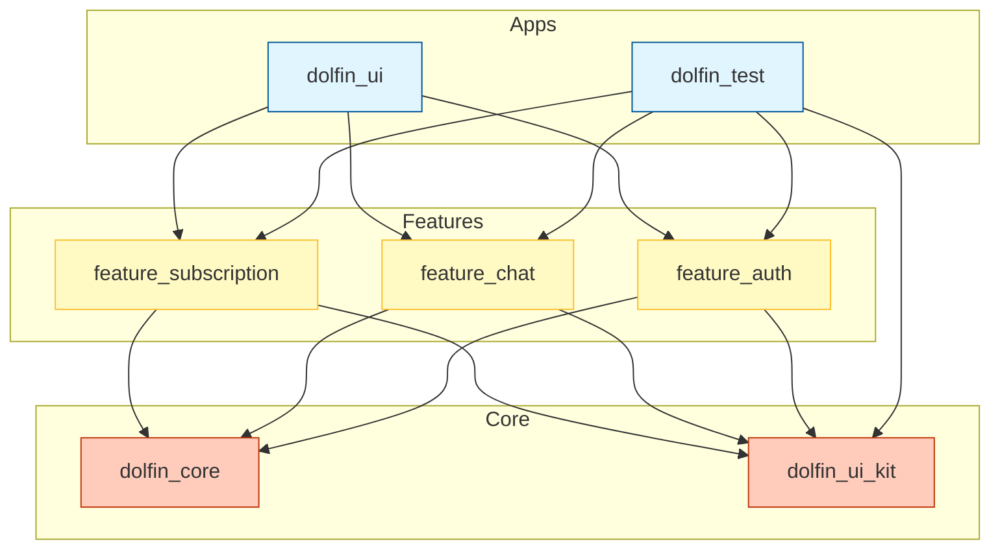

# Project Architecture

This document visualizes the high-level architecture of the **Dolfin Workspace** monorepo and the internal architecture of its feature packages.

## 1. High-Level Dependency Graph

The project follows a **Feature-First Monorepo** structure managed by **Melos**.



## 2. Feature Architecture (Clean Architecture)

Each feature package follows **Clean Architecture** principles, enforcing separation of concerns and unidirectional data flow.

```mermaid
graph LR
    subgraph Presentation["Presentation Layer (Flutter)"]
        UI[Pages & Widgets]
        SM[State Management (Cubit/Bloc)]
    end

    subgraph Domain["Domain Layer (Dart)"]
        UC[Use Cases]
        Ent[Entities]
        RepoInt[Repository Interfaces]
    end

    subgraph Data["Data Layer (Dart)"]
        RepoImpl[Repository Implementation]
        DS[Data Sources (Remote/Local)]
        Model[Models (DTOs)]
    end

    %% Data Flow
    UI --> SM
    SM --> UC
    UC --> RepoInt
    RepoImpl ..|> RepoInt
    RepoImpl --> DS
    DS --> Model
    Model ..|> Ent

    style Presentation fill:#e3f2fd,stroke:#2196f3
    style Domain fill:#e8f5e9,stroke:#4caf50
    style Data fill:#fff3e0,stroke:#ff9800
```

## 3. Data Flow & Dependency Injection

- **Dependency Injection**: Uses `get_it` with a Service Locator pattern.
  - Core modules (`Network`, `Storage`) are registered first.
  - Feature modules (`initChatFeature`, `initAuthFeature`) are registered by the consuming App.
- **State Management**: Uses `flutter_bloc` for UI state.
- **Data Transfer**:
  - `DataSource` returns `Model`.
  - `Repository` converts `Model` to `Entity`.
  - `UseCases` return `Either<Failure, Entity>`.
  - `Cubit` emits `States` based on `Entity`.
